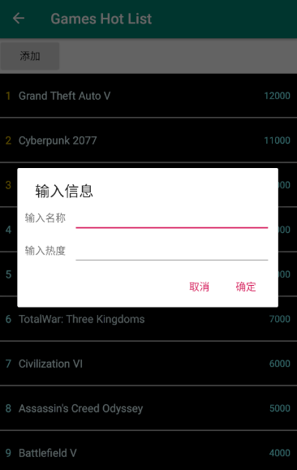
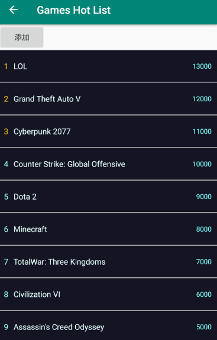

## 浙江大学安卓开发小学期 作业2

> 姓名：朱璟森
>
> 学号：3170104166
>
> 专业：计算机科学与技术

****

### 作业要求

创建一个Android app工程，使用`RecyclerView`，实现一个类似于热榜的列表。

### 作业实现

注：为了节省代码量，本次作业中的所有回调事件全部采用**Lambda 表达式**进行编写而非传统的`new OnClickListener() {@Override ......}`的形式。

本次作业共实现两个Activity，一个为登录界面，一个为热榜界面。

登录界面如下：


其中要求学号为10位数字，密码不得小于6位，否则会在`Toast`上弹出错误提示，无法进入下一界面。

点击“注册或登录”按钮进入热榜界面如下，是一个游戏排行榜的界面：


其中的热榜可以自由滑动。热榜前三的排名为黄色，与其他的浅蓝色不同。

### 进阶要求

本次作业实现了3个进阶要求：在`ItemDecoration`中增加分割线，在列表中增加元素，以及列表元素的点击事件。

#### 分割线

分割线的实现十分简单，只需一行代码：

```java
mRecyclerView.addItemDecoration(new DividerItemDecoration(this, DividerItemDecoration.VERTICAL));
```

分割线效果如上文中截图所示。

#### 增加元素

如上图，顶部有一个“添加”的按钮，点击就会弹出对话框：



输入名称与热度并点击“确定”就会将新的元素插入到列表中，且列表中的元素会按照热度进行重新排序，如输入“LOL”、13000后，热榜变为：



对话框的实现用到了`AlertDialog`类，为其制定自定义布局 (输入框)，并设置确定与取消按钮的回调函数。确定按钮的回调函数将输入的内容插入到`Adapter`的`List`中，并对`List`进行重新排序，最后调用`notifyDataSetChanged`函数更新列表。而取消按钮则会在`Toast`中弹出“已取消”的提示。

#### 元素点击事件

在热榜中，点击任意一个元素会弹出一个`AlertDialog`对话框，其标题为排名，正文内容为游戏名称与热度值，如图：


点击事件的实现为：在`Adapter`中的`onBindViewHolder`函数中，为`holder.itemView`设置`onClickListener`即可。

### 心得

本次作业使用了`RecyclerView`，巩固了上课内容，对`Adapter`, `ViewHolder`的使用增进了理解。而在进阶要求的实现中，通过上网搜索，自学了许多内容，收获颇丰。